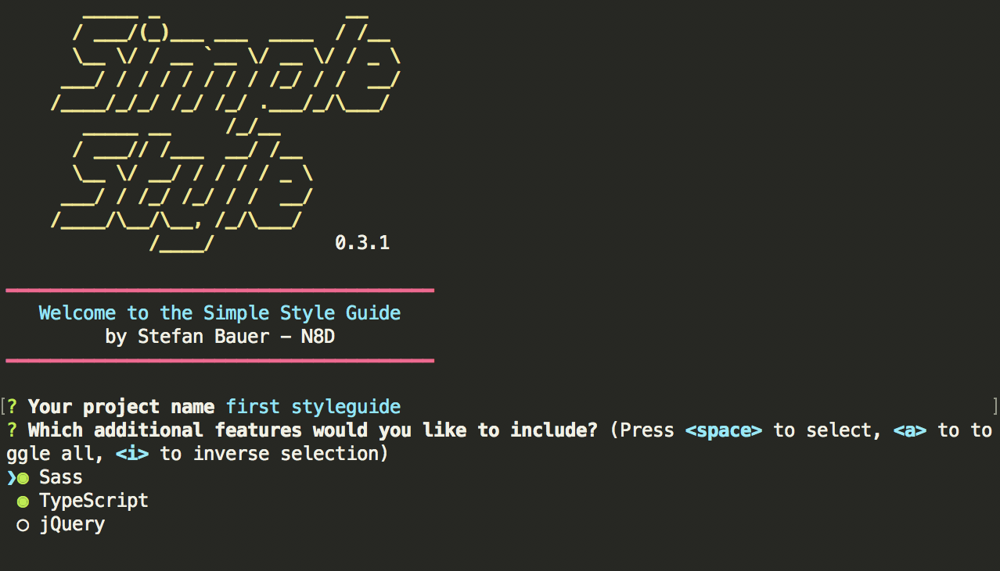
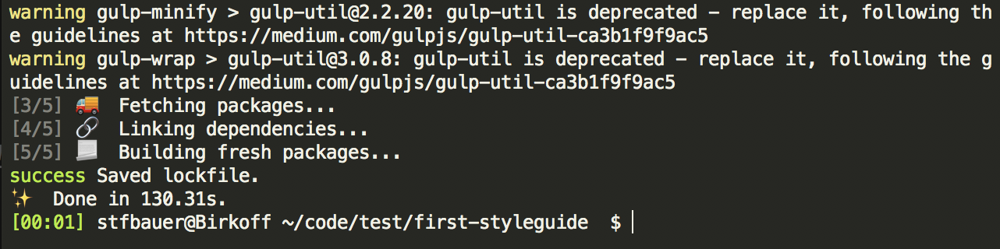

To create a new project open your terminal of choice (PowerShell, cmd, bash, zsh).

First create a new folder and change to this folder. Now execute the following command.

```sh
yo simplestyle
```

This will launch the wizard that creates the base structure and setup of your project.



The current SimpleStyle supports the following options:

* **SASS**
If unselected only plain CSS can be used
* **TypeScript**
TypeScript compiler won't be installed to generator
* **jQuery**
In addition to TypeScript jQuery can be added by default to the generator.

After the selection the required files gets copied to the project folder and the  NodeJS packages gets installed.
In case [Yarn](https://yarnpkg.com/en/) is installed all packages will be installed through this package manager, otherwise [NPM](https://www.npmjs.com) is used.



## Documentation
* [[Create first SimpleStyle project]]
* [[Working with patterns]]
* [[Create advanced patterns]]
* [[Important Folders]]
* [[Data Binding with SimpleStyle]]