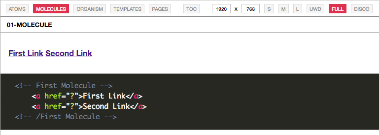

Especially with repeating UI elements those sometimes should be presented with different data. The default status of the style guide contains a new subfolder named `app/ssg-testing/_data` including a script named `ssg.data.js`. In this file all sample data can be entered you like to include in your style guide.

```javascript
var ssgData = {
    href: "?",
    title: "Hello World",
    navigation: [{
        href: "?",
        title: "Title"
    }]
}
```

The first href and title attribute in the ssgData JSON object will be used to render a link in a template. To access those data all that needs to be done shows the following example.

```handlebars
<!-- First Atom: shows content of ./app/atoms/01-atom.hbs -->
<p>This is the first atom which uses the data stored in the `_data` folder.
    <br>
    <br>
    <br> By the way the following hyperlink use data that data binding:
    <br>
    <a href="{{ href }}">{{ title }}</a>
</p>
<!-- /First Atom -->
```

In the code provided above the only thing that needs to be done is `{{ href }}` for the like url and the `{{ title }}` to reference the title property.

## Loop over array data
This even supports more advances scenarios for example if data from an array should used like stored in the `navigation` property.
In case you have the following configuration in the data file.

```javascript
var ssgData = {
    href: "?",
    title: "Hello World",
    navigation: [{
        href: "?",
        title: "First Link"
    }, {
        href: "?",
        title: "Second Link"
    }]
}
```

So now there are two links stored in the ssgData navigation property. Template that renders all link can look like this.  
  
```
<!-- First Molecule -->
{{#navigation }}
    <a href="{{ href }}">{{ title }}</a>
{{/navigation }}
<!-- /First Molecule -->
```

The ```{{ #navigation }}``` and the ```{{ /navigation }}}``` are basically the head and the bottom of the for loop that references to ```ssgData.navigation```. Inside this loop each element of the array has a property ```href``` and ```title```. This will render the following output and the code in your handlebar template.



