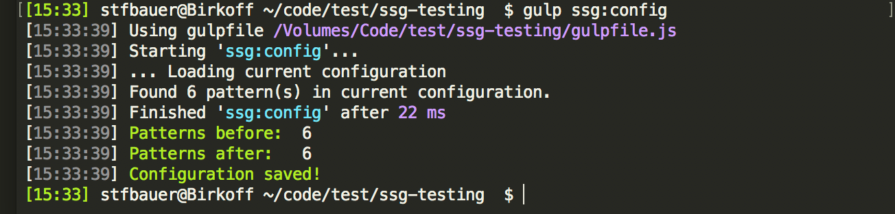

In general the style guide is based on Handlebars and use handlebar templates with the file extension `.hbs`. The storage location to store the template files can be found in the folder `app/_patterns`. Whenever a new pattern file will be added to one of the sub folders a gulp task detects to modification and adds the new created pattern to the configuration. This configuration is stored in the file `app/_config/pattern.conf.json`.

## Re-/Create configuration
In case the configuration file gets corrupted you can simple recreate a new file with all patterns. Before a new file will be created it is recommended to backup the current configuration. Simply rename or copy the file `app/_config/pattern.conf.json` to any other name. After the current configuration has been backup the following gulp task needs to be executed.

```bash
gulp ssg:config
```

This will create a blank file of the configuration and search the `_patterns` folder for existing patterns.



## Before you start
SimpleStyle use gulp task to detect changes in the files and update the configuration or the styles used in the style guide. To monitor file system changes simply execute the following gulp task before you begin working.

```
gulp serve
```

This will execute concurrent tasks on the current project folder as well as open your default web browser.


Now you are ready to create your first pattern. Simple open the current folder in your favorite code editor.

## Create and modify pattern
To create a new pattern simply add a new file to the folder 'app/_patterns' and save it with the extension `.hbs`. 


SimpleStyle picks up the new file and adds it automatically to the configuration.


In addition the new template will be precompiled using Handlebars and the browser will be refreshed. From now on whenever a the pattern file will be changed it will be automatically pre-compiled and the browser will be refreshed.


Now more [[advanced patterns|Create advanced patterns]] can be created.